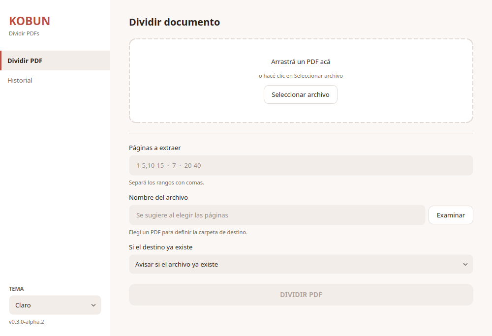
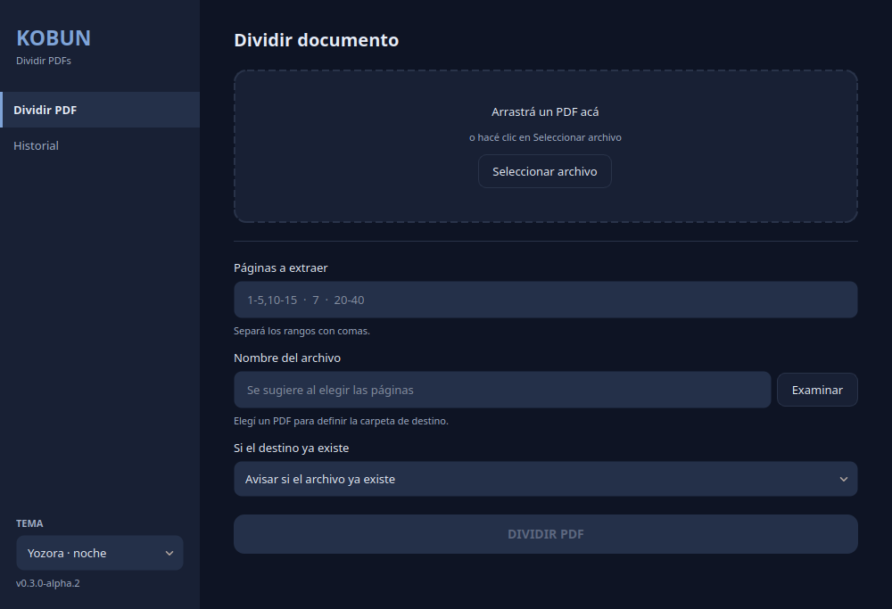

# Kobun — PDF Desktop Utility

[](https://github.com/IgnacioBarraza/kobun/actions/workflows/ci.yml)
[](https://github.com/IgnacioBarraza/kobun/releases/latest)

[](LICENSE)

Desktop utility that extracts page ranges from a PDF — **including
discontinuous ones, like `1-5,10-15,20`** — into a new file, without touching
the original. Built for the case that PDF viewers handle badly: pulling three
chapters out of a 600 page book in one pass.

Written in Python with **PySide6 (Qt)** and **PyMuPDF**, on a layered
architecture where the domain knows neither of them: **3,500 lines of code held
up by 2,700 of tests, 346 of which run with no dependencies installed at all.**

|                                                           |                                                             |
| --------------------------------------------------------- | ----------------------------------------------------------- |
|  |  |

<!--
The two captures above are placeholders taken headless, so they show an empty
window. Replace the files with real ones —a PDF loaded, a range typed, the
history with actual exports— keeping the same names:
    assets/screenshots/split-light.png
    assets/screenshots/split-yozora.png
    assets/screenshots/history-yozora.png
-->

---

## ⬇️ Download

Grab the latest build from the [releases page](https://github.com/IgnacioBarraza/kobun/releases/latest).
Versions tagged as pre-release come from `develop` and are meant for trying
changes early; the definitive ones come from `main`.

### Windows

`kobun.exe` is **portable**: download it and open it, there is nothing to
install. Windows will warn about an unsigned executable the first time.

### Linux

The `.deb` is the recommended route — it installs Kobun into the application
menu with its icon:

```bash
sudo apt install ./kobun_*_amd64.deb
```

The standalone `kobun` binary works on other distributions, with two caveats:
you have to make it executable with `chmod +x` (the download loses that bit),
and **modern file managers will not launch a binary on double click**, so run it
from a terminal.

### From source

```bash
python -m venv .venv && source .venv/bin/activate
pip install -r requirements.txt
kobun
```

---

## ✨ Features

### Splitting

- Extract page ranges, including discontinuous selections: `1-5,10-15,20`
- Overlapping or adjacent ranges are merged automatically — no duplicate pages
- Page indices are 1-based and inclusive, as printed in the document
- Output metadata derived from the source document, traceable back to it

### Choosing where it lands

- Suggested output filename: `book.pdf` + `1-5,10-15` → `book_1-5_10-15.pdf`,
  sanitized for Windows/Linux
- The destination field asks for a filename; the folder is shown separately
- Output never overwrites silently — `OverwritePolicy` (`FAIL` / `OVERWRITE` /
  `RENAME`) — and never writes over the source file

### Reading the input safely

- Rejects unreadable input before processing: missing files, directories,
  empty files, non-PDFs, and password-protected PDFs
- Strict domain validation for invalid page ranges
- Explicit domain-level exceptions — PyMuPDF errors never reach the caller

### Interface

- Drag & drop, or pick a file from the system dialog. It also opens a PDF passed
  on the command line or chosen through the desktop's "Open with"
- Long operations run on a worker thread, so the window never freezes
- Expected errors are reported as warnings; unexpected ones show a generic
  message and keep the technical detail for reporting
- **10 themes**, 5 light and 5 dark, most of them built around a Japanese
  palette (washi, indigo, matcha, ink, bamboo, violet…). The choice persists
  between sessions

### Export history

- Persistent history of the last 50 exports, stored per-OS in the user's data
  directory
- Entries whose file was moved or deleted are flagged, not dropped
- Open an exported PDF with the system viewer, or drop a single entry, straight
  from the list

---

## 🧱 Architecture

Kobun follows a layered structure inspired by Domain-Driven Design:

```
kobun/
│
├── domain/         # Core business rules and value objects
├── application/    # Use cases, DTOs and port interfaces
├── infrastructure/ # PDF engine, filesystem and persistence (PyMuPDF, JSON)
├── presentation/   # Qt UI (PySide6) and viewmodels
├── shared/         # Cross-cutting concerns (themes, settings, icons)
└── tests/          # unit/ (no dependencies) and integration/ (real PDFs, real window)

assets/             # Source artwork and screenshots, not shipped with the package
docs/               # Development and release documentation, plus the changelog
scripts/            # Build, packaging, release and desktop integration helpers
packaging/          # PyInstaller recipe and Inno Setup script
```

**Principles that are actually enforced, not just stated:**

- Immutable Value Objects, validated on construction and kept in canonical
  form — two selections covering the same pages are equal
- Explicit domain exceptions; the repository guarantees no PyMuPDF error escapes
- **Page indices are 1-based everywhere** — from `PageRange` up to the UI. The
  translation to PyMuPDF's 0-based API happens only inside `PdfEngineAdapter`
- The UI knows no use cases: the window talks to a viewmodel, and the viewmodel
  is the only thing that touches the application layer
- The `unit/` suite runs without PySide6 or PyMuPDF installed, and CI fails if
  that stops being true — which is what keeps the domain framework-free

---

## 🧪 Tests

```bash
pytest                    # everything
pytest kobun/tests/unit   # pure domain, no dependencies
```

Details, and everything about building and releasing, live in
[`docs/development.md`](docs/development.md).

---

## 📂 Example

1. Drop `book.pdf` on the window
2. Enter a page selection: `25-40`, or `1-5,10-15,20` for several sections at once
3. Click **DIVIDIR PDF**
4. Receive a PDF with exactly those pages, in that order

From code:

```python
document = load_use_case.execute(Path("book.pdf"))       # validates the source
selection = PageSelection.parse("1-5,10-15")

response = split_use_case.execute(SplitPdfRequest(
    input_path=document.storage_path,
    selection=selection,
    output_path=None,                                    # suggested name
    policy=OverwritePolicy.RENAME,                       # do not fail if taken
))

record_use_case.execute(response)                        # add it to the history
```

---

## 🛣 Roadmap

Done:

- [x] Multiple range support (`1-5,10-15`), merged and canonicalised
- [x] Output path selection with an overwrite policy
- [x] Export history
- [x] Qt UI wired to the use cases through a viewmodel
- [x] Light / dark theme system — 10 palettes, contrast verified by tests
- [x] Installable package with a `kobun` entry point
- [x] Windows and Linux packaging: portable `.exe`, `.deb`, Inno Setup installer
- [x] Automated versioning, changelog and releases derived from the commits

Next:

- [ ] Page preview before splitting
- [ ] Live page count while typing a selection
- [ ] Repeat an export from the history (the selection is already stored as a
      Value Object precisely for this)
- [ ] Merge PDFs and extract text — implemented in the repository layer, not yet
      exposed in the interface
- [ ] Batch splitting
- [ ] A CLI alongside the window
- [ ] Code signing for Windows, to drop the SmartScreen warning
- [ ] macOS build, once there is a machine to verify it on

---

## 🤝 Contributing

Contributions are welcome. Fork, branch, and open a pull request with a clear
technical description.

Two conventions worth knowing before the first commit:

- **Commits follow [Conventional Commits](https://www.conventionalcommits.org/)**,
  and they decide the version. `feat:` publishes a minor, `fix:` a patch, and a
  commit with no `type:` prefix publishes nothing at all — see
  [`docs/releasing.md`](docs/releasing.md)
- **Code and comments are in English; the interface is in Spanish.** That
  includes the messages of domain exceptions, which the UI shows to the user
  verbatim

And please keep the boundaries the project is built on: domain logic stays
UI-agnostic, new features come with validation and explicit error handling, and
the `unit/` suite must still run without PyMuPDF or PySide6 installed.

---

## 📄 License

Released under the MIT License. See [`LICENSE`](LICENSE) for details.
